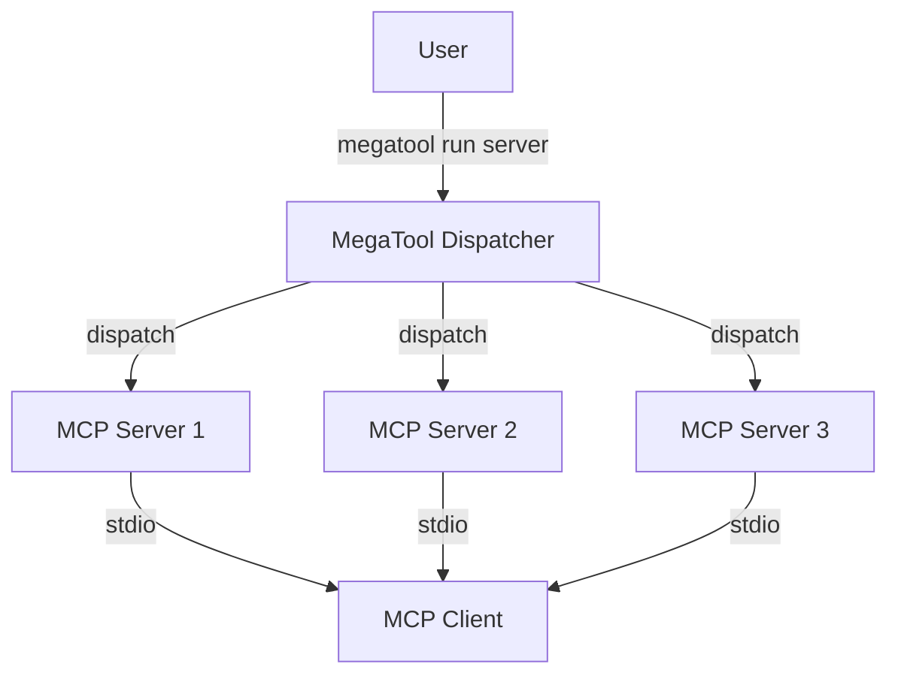
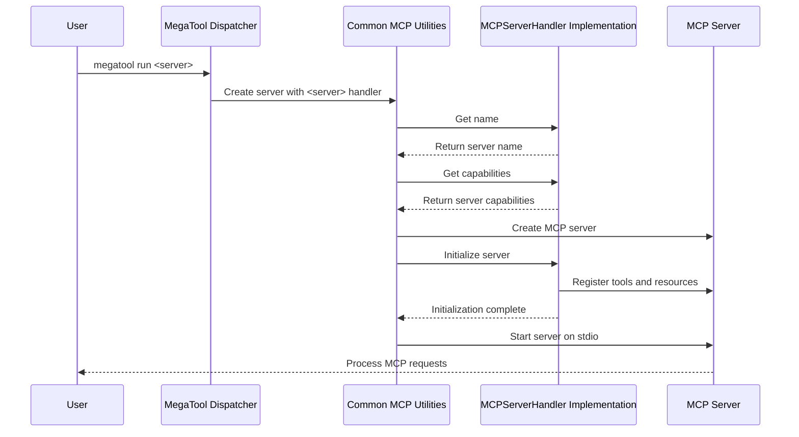

# MegaTool Architecture

This document provides an overview of the MegaTool architecture and design principles.

## System Overview

MegaTool is designed as a collection of independent MCP servers, each implemented as a separate binary, with a main dispatcher binary that routes commands to the appropriate server.



## Core Components

### MegaTool Dispatcher

The main `megatool` binary serves as a dispatcher that:

1. Parses command-line arguments
2. Identifies the requested MCP server
3. Executes the appropriate server binary
4. Handles global flags and configuration

The dispatcher is implemented in `cmd/megatool/main.go`.

### MCP Servers

Each MCP server is implemented as a separate binary with a name following the pattern `megatool-<server>`. Current servers include:

- `megatool-calculator`: Simple calculator operations
- `megatool-github`: GitHub API integration
- `megatool-package-version`: Package version checking

Each server follows the Model Context Protocol specification and communicates with clients over stdio.

### Configuration Management

MegaTool uses a secure configuration system that:

1. Stores sensitive data (like API keys) in the system keyring
2. Manages server-specific configuration
3. Provides a consistent configuration interface

Configuration is handled by the `internal/config` package.

## Communication Flow

1. The user invokes `megatool run <server>`
2. The dispatcher identifies the server and executes the corresponding binary
3. The server binary initializes and waits for MCP requests on stdin
4. The MCP client sends requests to the server
5. The server processes the requests and sends responses back to the client
6. Communication continues until the server is terminated

## Design Principles

### 1. Separation of Concerns

Each MCP server is independent and focuses on a specific domain. This allows for:

- Independent development and testing
- Simplified maintenance
- Clear responsibility boundaries

### 2. Security First

Security is a primary concern, especially for servers that handle sensitive data:

- API keys and tokens are stored in the system keyring
- Configuration is managed securely
- Authentication is handled appropriately for each service

### 3. Consistent Interface

All MCP servers follow the same patterns:

- Consistent command-line interface
- Standard configuration approach
- Uniform error handling and logging

### 4. Extensibility

The architecture is designed to be easily extensible:

- Adding a new MCP server is straightforward
- Common functionality is shared through internal packages
- The dispatcher can accommodate new servers without significant changes

## Directory Structure

```
megatool/
├── cmd/
│   ├── megatool/                  # Main dispatcher
│   ├── megatool-calculator/       # Calculator server
│   ├── megatool-github/           # GitHub server
│   └── megatool-package-version/  # Package version server
├── internal/
│   ├── config/                    # Configuration management
│   └── utils/                     # Shared utilities
└── bin/                           # Build output directory
```

## MCP Implementation

MegaTool implements the Model Context Protocol, which defines:

1. **Tools**: Functions that can be called by the client
2. **Resources**: Data that can be accessed by the client
3. **Communication Protocol**: JSON-RPC over stdio

Each server implements the MCP specification, providing tools and resources relevant to its domain.

## Error Handling

MegaTool follows a consistent error handling approach:

1. User-facing errors are clear and actionable
2. Internal errors are logged with appropriate context
3. MCP protocol errors follow the MCP specification

## MCP Server Implementation Pattern

To standardize MCP server implementations and reduce code duplication, MegaTool provides a common interface and utility functions for implementing MCP servers.

### MCPServerHandler Interface

The `MCPServerHandler` interface defines the contract that all MCP servers must implement:

```go
// MCPServerHandler defines the interface for MCP server implementations
type MCPServerHandler interface {
    // Initialize sets up the server and registers all tools/resources
    Initialize(s *server.MCPServer) error
    
    // Name returns the display name of the server
    Name() string
    
    // Capabilities returns server capability options
    Capabilities() []server.ServerOption
}
```

This interface abstracts the common functionality of MCP servers, allowing for:

1. Standardized server initialization
2. Common error handling and logging
3. Consistent versioning across all servers
4. Simplified implementation of new servers

### Common Utilities

The `internal/mcpserver` package provides utilities for:

1. **Logger Setup**: Create and configure a standard logger
2. **Server Creation**: Create and run an MCP server with a standard interface
3. **CLI App Generation**: Generate a CLI app with standard flags and error handling
4. **Version Management**: Access the global MegaTool version
5. **Parameter Extraction**: Helper functions for extracting and validating parameters

### Architecture Flow

The updated architecture follows this pattern:



This architecture ensures consistency across all MCP server implementations while allowing for server-specific functionality to be cleanly implemented.

## Future Architecture Directions

Potential future enhancements to the architecture include:

1. **Plugin System**: Allow for dynamically loaded plugins
2. **Remote Servers**: Support for running MCP servers remotely
3. **Service Discovery**: Automatic discovery of available servers
4. **Enhanced Security**: Additional security measures for sensitive operations
5. **Metrics and Monitoring**: Built-in support for monitoring server performance
